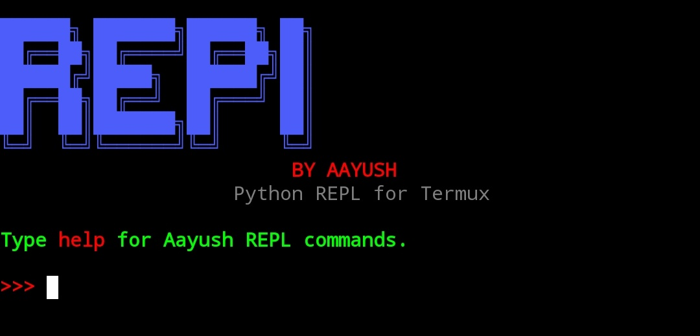
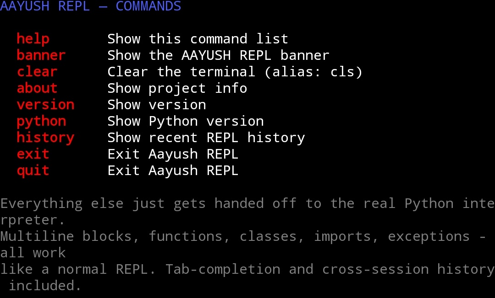

# REPL BY AAYUSH

A branded Python REPL for Termux, custom commands, persistent history, tab-completion, and the real Python `InteractiveConsole` underneath.



## Installation (Termux)

Copy-paste one line at a time, in this exact order. No file download needed — this pulls straight from GitHub.

```bash
pkg update -y && pkg upgrade -y
```

```bash
pkg install git -y
```

```bash
pkg install python -y
```

```bash
cd ~
```

```bash
git clone https://github.com/aayushzen/Aayush-Repl.git
```

```bash
cd Aayush-Repl
```

```bash
chmod +x install.sh aayush-repl aayush_repl.py
```

```bash
bash install.sh
```

```bash
aayush-repl
```

## Commands



`help` `banner` `clear` (alias `cls`) `about` `version` `python` `history` `exit` `quit`

Everything else is handled by Python itself, including multiline statements, functions, classes, imports, exceptions, comprehensions, and normal Python expressions.

## Features (v3.1)

- Tab-completion for names in scope
- Cross-session history — saved to `~/.aayush_repl_history`
- Auto-indent on continuation lines after a line ending in `:`
- Colored (red) tracebacks and syntax errors
- `exit()` / `quit()` call form works, not just the bare word
- Typing a variable named `history`, `exit`, `quit`, etc. correctly shows your variable, not the built-in command
